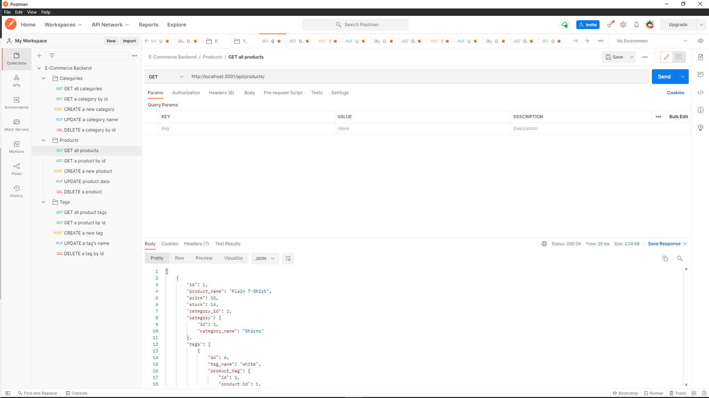

# E-commerce

## Application Description
- This application utilizes MySQL2 and Sequelize to create organized and updatable tables within a database. Express is used to code accessible APIs so the user can create, read, update, and delete data from an API platform like Insomnia or Postman.

[E-commerce](https://watch.screencastify.com/v/92WZZuZLjLUjNtWxWIKq)

## Table of Contents
* [Description](#application-description)
* [Installation](#installation)
* [Usage](#usage)
* [License](#license)
* [Contributions](#contributions)
* [Testing](#testing)
* [Questions](#questions)
* [Screenshot](#screenshot)

## Installation
- Use npm install if cloning the repository.

## Usage
Please use it.

## License
N/A

## Contributions
You can contribute by creating a new issue.

## Testing
N/A

## Questions
Please feel free to reach out with any questions or concerns. I can be reached at victorj500@gmail.com or on GitHub at github.com/vic-smith.

## Screenshot

